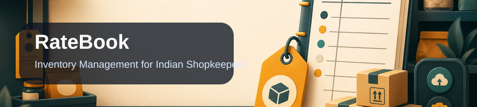
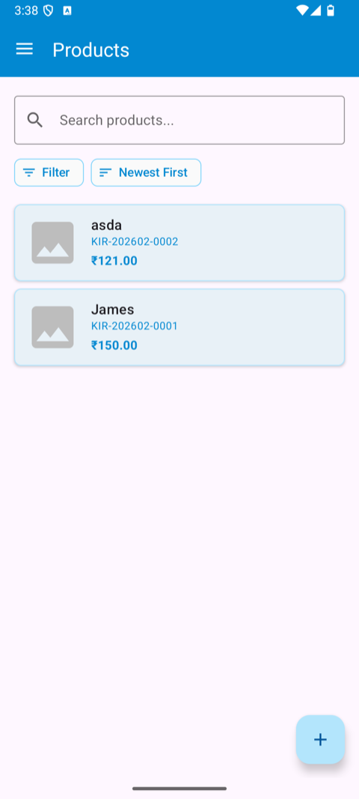
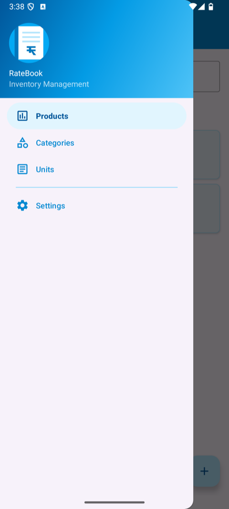
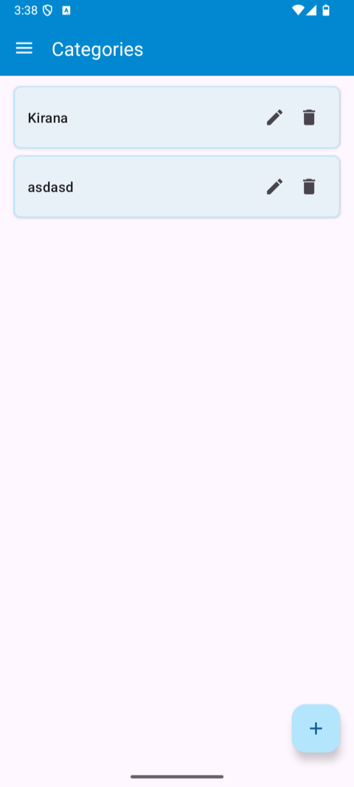
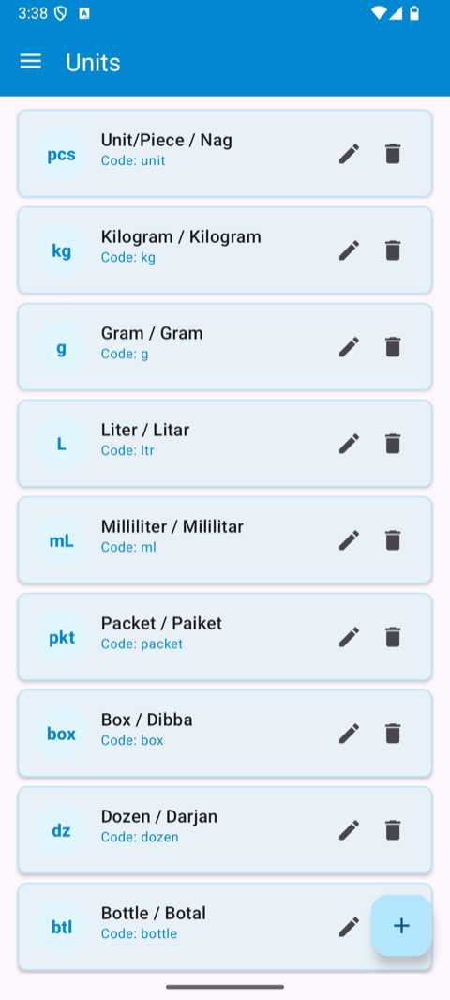
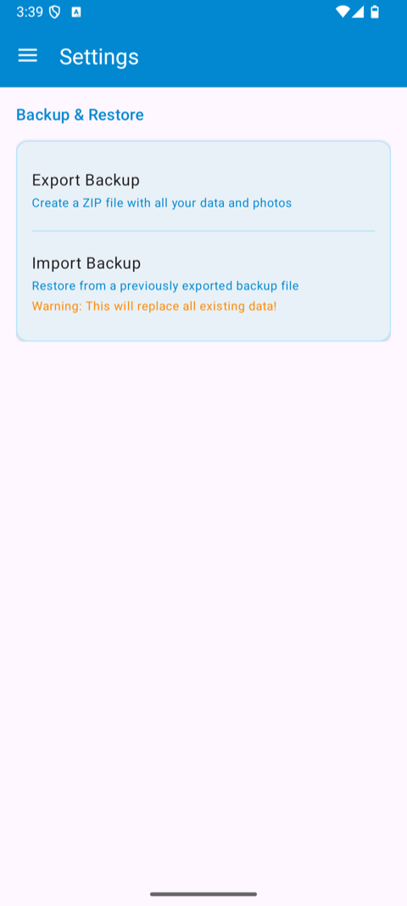
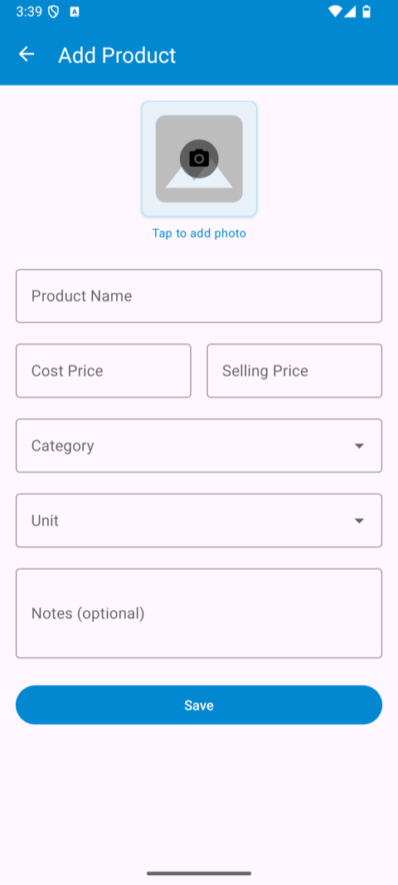

<p align="center">
  
</p>

# RateBook

**Inventory Management App for Indian Shopkeepers**

A simple, powerful Android app designed for small shop owners in India to manage their product inventory with ease. Features multi-language search (Hindi/English/Hinglish), photo support, and easy data backup via ZIP export.

---

## Screenshots

A visual walkthrough of the app.

<table align="center">
  <tr>
    <td width="33%" align="center"><br/><sub>Product list with search & sort</sub></td>
    <td width="33%" align="center"><br/><sub>Navigation drawer</sub></td>
    <td width="33%" align="center"><br/><sub>Manage categories</sub></td>
  </tr>
  <tr>
    <td width="33%" align="center"><br/><sub>Bilingual measurement units</sub></td>
    <td width="33%" align="center"><br/><sub>Backup & restore</sub></td>
    <td width="33%" align="center"><br/><sub>Add a product</sub></td>
  </tr>
</table>

---

## Features

### Product Management
- **Add/Edit/Delete Products** - Full CRUD operations with intuitive UI
- **Photo Support** - Capture from camera or select from gallery
- **Auto-generated SKU** - Format: `CAT-YYYYMM-NNNN` (e.g., `GUT-202602-0001`)
- **Cost & Selling Price** - Track both prices in INR

### Multi-Language Search
- **Hindi Support** - Search in Devanagari script (चाय, गुटखा)
- **English Support** - Search in English (Tea, Gutkha)
- **Hinglish Support** - Search in romanized Hindi (chai, gutka)
- **Smart Transliteration** - Automatically normalizes text for unified search

### Organization
- **Categories** - Group products by type (गुटखा, सिगरेट, राशन, तेल)
- **Filter by Category** - Quick filtering with single tap
- **Sort Options** - By name, cost price, selling price, SKU, or date
- **Measurement Units** - Bilingual units (kg/किलोग्राम, pcs/नग, etc.)

### Data Backup & Restore
- **ZIP Export** - Complete backup including all data and photos
- **Save to Device** - Save backup file directly to phone storage
- **Share Backup** - Send via WhatsApp, Email, or any app
- **Import Backup** - Restore data on any device

---

## Default Categories

| Hindi | English | Examples |
|-------|---------|----------|
| गुटखा | Gutkha | Pan Parag, Rajnigandha |
| सिगरेट | Cigarette | Gold Flake, Classic |
| राशन | Rashan | चाय, चीनी, चावल (Tea, Sugar, Rice) |
| तेल | Oil | खाने का तेल, बालों का तेल (Cooking, Hair) |

---

## Default Measurement Units

| Symbol | Name (Hindi/English) |
|--------|---------------------|
| pcs | नग / Unit/Piece |
| kg | किलोग्राम / Kilogram |
| g | ग्राम / Gram |
| L | लीटर / Liter |
| mL | मिलीलीटर / Milliliter |
| pkt | पैकेट / Packet |
| box | डिब्बा / Box |
| dz | दर्जन / Dozen |
| btl | बोतल / Bottle |
| bag | थैला / Bag |

---

## Technical Details

### Architecture
- **MVVM Pattern** - Clean separation of concerns
- **Room Database** - Local SQLite storage with type-safe queries
- **Kotlin Coroutines** - Asynchronous operations
- **StateFlow** - Reactive UI updates
- **Material 3** - Modern Android design system

### Database Schema

```
products
├── id (PK)
├── sku (UNIQUE) - Auto-generated
├── name
├── name_normalized - For search
├── cost_price
├── selling_price
├── category_id (FK)
├── measurement_unit_id (FK)
├── notes
├── photo_path
├── created_at
└── updated_at

categories
├── id (PK)
├── name (UNIQUE)
├── name_normalized
├── display_order
└── created_at

measurement_units
├── id (PK)
├── code (UNIQUE)
├── name
├── symbol
├── display_order
└── created_at
```

### Backup Format

```
ratebook_backup_YYYYMMDD_HHMMSS.zip
├── manifest.json
├── data/
│   ├── products.json
│   ├── categories.json
│   └── measurement_units.json
└── photos/
    └── YYYY/MM/
        └── product_*.jpg
```

---

## Installation

### From Release
1. Go to [Releases](../../releases)
2. Download the latest `app-debug.apk`
3. Install on your Android device (enable "Install from unknown sources" if needed)

### Build from Source
```bash
# Clone the repository
git clone https://github.com/sunil-dhaka/RateBook.git

# Open in Android Studio
# Build > Make Project
# Run > Run 'app'
```

---

## Requirements

- Android 7.0 (API 24) or higher
- ~50 MB storage space
- Camera permission (for product photos)
- Storage permission (for backup export)

---

## Tech Stack

| Component | Technology |
|-----------|------------|
| Language | Kotlin |
| UI | Material 3 Components |
| Database | Room (SQLite) |
| Async | Kotlin Coroutines |
| Image Loading | Coil |
| Serialization | Kotlinx Serialization |
| Navigation | Jetpack Navigation Component |

---

## License

This project is private and not licensed for public distribution.

---

## Author

**Sunil Dhaka**

---

*Built with Claude Code*
